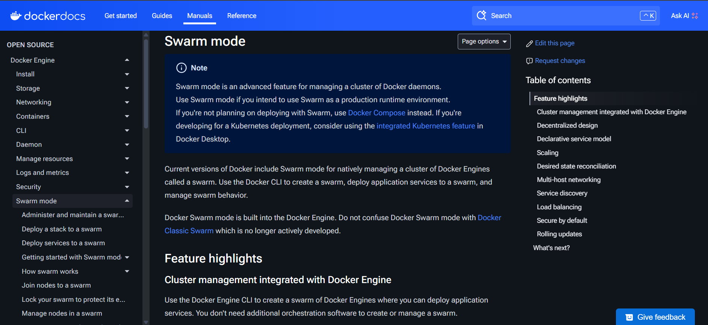
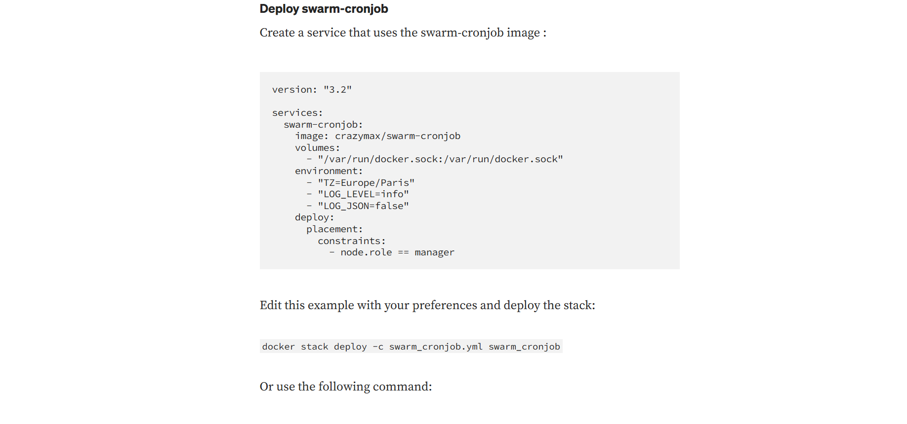
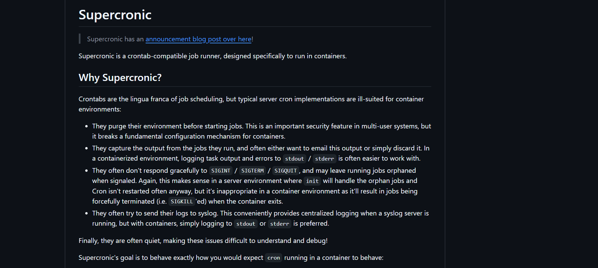

# Docker Swarm: Overview and Cron Job Scheduling

## What is Docker Swarm?

- **Docker Swarm** is Docker’s native clustering and orchestration solution for managing a group of Docker engines (hosts) as a single virtual system.
- It enables you to deploy, scale, and manage containerized applications in a highly available and distributed environment.
- Key features include simplified container scheduling, service discovery, load balancing, rolling updates, and fault tolerance.

---

## How to Set Up Docker Swarm

- **Initialize the Swarm:**
  - On the manager node, run:
    ```
    docker swarm init
    ```
- **Add worker nodes:**
  - Get the join token from the manager node:
    ```
    docker swarm join-token worker
    ```
  - On each worker node, use the provided join command.
- **Deploy services:**
  - Example:
    ```
    docker service create --name my_service --replicas 3 nginx
    ```
- **Verify nodes and services:**
  - View nodes: `docker node ls`
  - View services: `docker service ls`

---

## What is a Docker Swarm Cron Job?

- A **Docker Swarm cron job** refers to running scheduled tasks (like periodic backups, cleanups, or maintenance jobs) managed by Docker Swarm.
- Unlike Kubernetes, Docker Swarm doesn’t have a native scheduler for cron-like jobs, but you can achieve this using external tools or containers with built-in schedulers.

**References:**  
- [Scheduling jobs with cron in Docker Swarm](https://crazymax.medium.com/create-jobs-on-a-time-based-schedule-on-swarm-94258f95c905) 
- [Supercronic GitHub](https://github.com/aptible/supercronic)

---

## How to Create a Cron Job in Docker Swarm

- **Option 1: Use a cron-enabled container as a Swarm service**
  - Deploy a container that runs cron (e.g., a custom Alpine or Ubuntu image with a crontab).
  - Example Dockerfile:
    ```
    FROM alpine
    RUN apk add --no-cache curl && \
        echo "* * * * * root echo Hello from Swarm Cron" > /etc/crontabs/root
    CMD ["crond", "-f"]
    ```
  - Deploy to Swarm:
    ```
    docker service create --name cronjob --replicas 1 my-cron-image
    ```
  - **Source:** [Docker Swarm - Scheduling jobs with cron](https://lobotuerto.com/docker/docker-swarm-scheduling-jobs-with-cron/)

- **Option 2: Use an external scheduler**
  - Use tools like [go-cron](https://github.com/odise/go-cron), [supercronic](https://github.com/aptible/supercronic), or `cron` itself in a container.
  - Example service creation with a scheduling entrypoint:
    ```
    docker service create --name scheduled-task my-cron-image
    ```  

- **Option 3: Use host system `cron` to trigger Swarm tasks**
  - Add a crontab entry on the Swarm manager that uses `docker service update` or `docker service scale` to run a task on schedule.
  - Example crontab entry:
    ```
    0 2 * * * docker service update --force my_job_service
    ```
  - **Reference:** [Docker forum: Scheduled tasks/cronjobs in Swarm](https://forums.docker.com/t/scheduled-tasks-cronjobs-in-swarm/35474)

---

## Summary

- **Docker Swarm** clusters and orchestrates Docker containers over multiple hosts.
- **Setup** requires initializing Swarm on a manager and joining workers.
- **Swarm does NOT have native cron job support**—you need to simulate this with cron-enabled containers or by triggering jobs using the host’s scheduler.
- **To run cron jobs in Swarm:**
  - Deploy services running cron/scheduler inside the container.
  - Use images like Alpine or Ubuntu with crontab configured.
  - Alternatively, use the manager’s system cron to trigger Swarm job/service restarts.
- **Best practices:**
  - Use minimal containers dedicated to scheduled tasks.
  - Monitor job execution and logs for reliability.
  - Document job schedules and Swarm service definitions.

---

**Screenshots for research sources:**  
1. [Docker Swarm Official Documentation](https://docs.docker.com/engine/swarm/)  


2. [Scheduling jobs with cron in Docker Swarm](https://crazymax.medium.com/create-jobs-on-a-time-based-schedule-on-swarm-94258f95c905)  


3. [Supercronic GitHub](https://github.com/aptible/supercronic)  


4. [Crazymax Docs](https://crazymax.dev/swarm-cronjob/)

